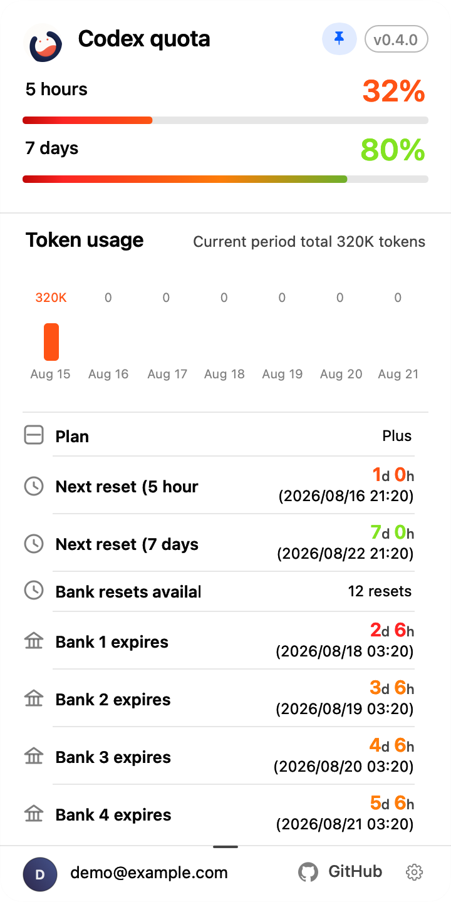
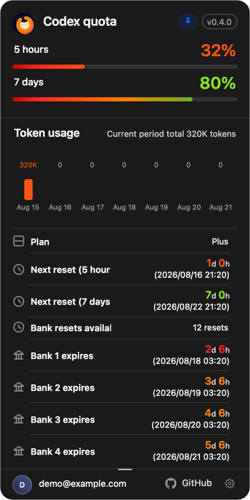
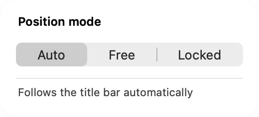
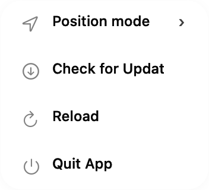

<h1 align="center">Codex Usage Sidebar</h1>

<p align="center">
  Live Codex quota, reset time, Credits, and Bank details in the Codex titlebar.
</p>

<p align="center">
  <a href="README.zh-CN.md">简体中文</a> ·
  <a href="docs/INSTALL.md">Install</a> ·
  <a href="docs/INSTALL_FOR_AGENTS.md">Install with an agent</a> ·
  <a href="docs/TROUBLESHOOTING.md">Troubleshooting</a>
</p>

<p align="center">
  <a href="https://github.com/JaceHwang/codex-usage-sidebar/actions/workflows/ci.yml"></a>
  <a href="https://github.com/JaceHwang/codex-usage-sidebar/releases"></a>
  <a href="LICENSE"></a>
  
  
</p>

> [!NOTE]
> This is an independent community project and is not affiliated with or endorsed by OpenAI.

## Platform status

| Platform | Status | Distribution |
| --- | --- | --- |
| macOS 14+ Apple Silicon | [v0.4.0 release](https://github.com/JaceHwang/codex-usage-sidebar/releases/tag/v0.4.0) | Published arm64 DMG with placement modes, detail lock, settings and improved collision handling |
| Windows 11 AMD64 (`x64`) | [v0.4.1 release](https://github.com/JaceHwang/codex-usage-sidebar/releases/tag/v0.4.1) | Unsigned `x64` setup with signed compatibility updates; Windows ARM64 is out of scope |

**macOS 0.4.0 and Windows 0.4.1 are available.** Each platform is distributed from its verified release assets.

See the [current feature inventory](docs/CURRENT_FEATURES.md) and [current design](docs/CURRENT_DESIGN.md).

## Live macOS capture


Captured on September 16, 2026 from the installed 0.4.0 local build on an Apple Silicon Mac. This is the actual companion window with live quota values; the host conversation is excluded.

## Current appearance

<p align="center">
  
  
</p>

Fresh renders of current AppKit controls with fixed demonstration data: dual quota, seven-day Tokens, detail lock, Bank expiry accents and footer settings. The detail lock is enabled in these fixtures. These are not live account captures or published-release screenshots.

<p align="center">
  
  
</p>

[Image provenance and reproduction](docs/images/current/README.md).

## Adaptive titlebar placement

- **Automatic** searches titlebar space using the measured label width, avoiding real buttons, actionable controls and static titles.
- **Default fallback** remains visible when no safe slot fits. If an interactive control overlaps that default, the mode switches to **Free** and is saved; it never silently switches back.
- **Free** supports left-button dragging and saves positions per display.
- **Locked** preserves the manual position and prevents dragging. This is independent from the detail card's lock button.

Right-click the indicator or use the detail footer's settings menu to select a mode. Choose Automatic explicitly to resume automatic placement.


## What it does

| Interaction or content | macOS 0.4.0 behavior |
| --- | --- |
| Indicator | Aligned 5-hour/7-day percentages and reset times; single-window display when secondary data is absent. |
| Hover and click | Hover opens details; click pins/unpins. An outside click dismisses an ordinary pinned card. |
| Detail lock | The header lock keeps details open across pointer departure and outside clicks until unlocked. |
| Detail data | Dual progress bars, seven-day daily/total Tokens, account, version, plan, Credits and every Bank entry's status/expiry. |
| Bank urgency | Red at up to 3 days, orange above 3 through 7 days, green above 7 days; unknown expiry has no urgency accent. |
| Resize | Natural details viewport: at least 8 rows (256 points), growing with content; manual minimum 2. The footer grip resizes the scrolling region; width remains 360 points. |
| Settings | Position mode, Check for updates, Reload and Quit. Check for updates opens GitHub Releases, without automatic download/install. |
| Appearance and language | Codex light/dark theme and effective Simplified Chinese, Traditional Chinese or English; other locales fall back to English. |
| Live placement | Automatic mode re-scans every 0.1 seconds; button roles/direct press or pick actions count, generic container auxiliary actions do not. |

Missing snapshots, stale data or a background Codex window can still hide the overlay. Those are distinct from the crowding-to-Free transition.

## Quick install

Choose the platform-specific installation path below. Windows support is Windows 11 AMD64/x64 only;
Windows ARM64 is not supported. The v0.4.1 setup uses explicit unsigned-install safeguards and must
be verified by SHA-256 before launch.

### Windows 11 AMD64/x64

Requirements: Windows 11 on AMD64/x64, Codex desktop for Windows installed and signed in, and
PowerShell. There is no fixed minimum Codex file version. New Codex builds are accepted when their
title bar exposes the validated semantic UI structure; an unknown or unsafe structure remains
fail-hidden until it can be validated.

#### Manual setup install

1. Open the [v0.4.1 GitHub Release](https://github.com/JaceHwang/codex-usage-sidebar/releases/tag/v0.4.1) and download only
   `codex-usage-sidebar-v0.4.1-windows-x64-setup.exe` plus `WINDOWS-V041-SHA256SUMS.txt`.
2. Verify the setup SHA-256 before launching it:

   ```powershell
   Get-FileHash .\codex-usage-sidebar-v0.4.1-windows-x64-setup.exe -Algorithm SHA256 | Select-Object -ExpandProperty Hash
   ```

   Compare it case-insensitively with the matching entry in `WINDOWS-V041-SHA256SUMS.txt`.
3. Run the verified setup for the current user:

   ```powershell
   Start-Process .\codex-usage-sidebar-v0.4.1-windows-x64-setup.exe
   ```

4. The setup is intentionally unsigned (`NotSigned`), so Windows may show **Unknown publisher**.
   Only after the SHA-256 matches, choose **More info**, then **Run anyway**.
5. Never disable Defender, SmartScreen, antivirus, or system policy. If the digest differs, delete
   the file and download it again from the release. The companion installs under
   `%LOCALAPPDATA%\CodexUsageSidebar\Current` and starts from the current-user Run key.

If Codex exposes an unsupported UI Automation structure, the Windows overlay stays hidden instead
of guessing coordinates. See [Installation and operations](docs/INSTALL.md) for `--repair`,
`--uninstall`, status output, and validation boundaries.

#### Agent-assisted automatic install

Give your Windows coding agent this task:

```text
Install Codex Usage Sidebar v0.4.1 from the GitHub Release on this Windows 11 AMD64/x64 machine.
Download codex-usage-sidebar-v0.4.1-windows-x64-setup.exe and WINDOWS-V041-SHA256SUMS.txt only,
verify the setup SHA-256 against the matching release entry, run the setup only if the digest matches, and report the install
path and runtime status. Do not disable or bypass Defender, SmartScreen, antivirus, or system policy.
If an installer, SmartScreen, uninstall, or Windows security dialog appears, stop and ask me for
immediate confirmation before clicking it.
```

An agent can automate the download, checksum comparison, and setup launch, but it must not bypass
Windows trust UI or claim the setup lifecycle was locally validated unless it actually completed
that validation on the target machine. See [Install with an agent](docs/INSTALL_FOR_AGENTS.md) for
the deterministic playbook.

### macOS 14+ Apple Silicon

Requirements: Codex desktop for macOS, macOS 14 or later, Apple Silicon, and the `codex` CLI with
plugin support. The installer does not pin a Codex version. It searches the standard locations and
the current `PATH`; a CLI release is compatible when it provides the `plugin marketplace` and
`plugin add` commands used by the installer.

#### Install the v0.4.0 DMG

Download `codex-usage-sidebar-v0.4.0-macos-arm64.dmg` together with
`MACOS-V040-SHA256SUMS.txt` and `MACOS-V040-PROVENANCE.json` from the
[v0.4.0 GitHub Release](https://github.com/JaceHwang/codex-usage-sidebar/releases/tag/v0.4.0).
Verify the DMG before opening it:

```bash
shasum -a 256 codex-usage-sidebar-v0.4.0-macos-arm64.dmg
```

Compare the result with the matching entry in `MACOS-V040-SHA256SUMS.txt`. `MACOS-V040-PROVENANCE.json`
records the exact source commit and embedded executable digests. Open the verified DMG,
then open **Codex Usage Sidebar Installer**. This asset is not notarized;
if macOS blocks it, right-click the installer in Finder and choose Open. Click **Install**, complete the
guided Codex login, enable Accessibility for **Codex Usage Sidebar** when macOS asks, then click
**Verify** to confirm that the managed companion is running.

The installer keeps its files outside the Codex application and never copies your normal `~/.codex`
credentials. See [Installation and operations](docs/INSTALL.md) for repair, update, and uninstall
behavior.

#### Reproduce the macOS v0.4.0 release asset

Use Xcode 26.5 with macOS SDK 26.5 (or explicitly select that SDK with `SDKROOT`).
Maintainers can rebuild the release asset from the exact v0.4.0 source commit recorded in the
provenance file. The scripts bind the payload commit into the app and never overwrite an existing
asset:

```bash
bash scripts/build-macos-v040-installer.sh
bash scripts/package-macos-v040-installer.sh
bash scripts/verify-macos-v040-installer-package.sh \
  ".dist/v0.4.0/macos/Codex Usage Sidebar Installer.app" \
  ".dist/v0.4.0/macos/codex-usage-sidebar-v0.4.0-macos-arm64.dmg"
```

### Advanced: manual marketplace installation

```bash
codex plugin marketplace add JaceHwang/codex-usage-sidebar
codex plugin add codex-usage-sidebar@codex-usage-sidebar
```

Start a **new Codex task** after installation. Codex loads plugins at the task boundary, and the
`SessionStart` hook installs and starts the companion. This follows the same task-boundary model
described in the [official Codex plugin workflow](https://developers.openai.com/learn/developers-codex-plugin/).

The companion uses its own Codex home so it never copies credentials from your normal `~/.codex`.
Authorize that isolated home once:

```bash
env CODEX_HOME="$HOME/Library/Application Support/CodexUsageSidebar/CodexHome" codex login
```

Then enable Accessibility for **Codex Usage Sidebar** when macOS asks. See
[Installation and operations](docs/INSTALL.md) for exact status, update, repair, and removal steps.

## Collision-aware positioning

The full relevant titlebar is scanned and final placement is checked using the actual indicator width (164–280 points) and an 8-point gap, including cached/default frames. Containers exposing only `AXShowMenu`/`AXScrollToVisible` are not buttons; button roles and direct `AXPress`/`AXPick` controls remain obstacles. Conversation bodies are not read.

A semantic anchor is a preference, not the final displayed position after free-slot search or manual placement. See [current design](docs/CURRENT_DESIGN.md).

## Live details

- Remaining percentage and next reset time are always visible in the compact control.
- A compact outlined badge beside the quota-card title reads the app bundle version, so the
  visible UI and installed code can be identified without opening a terminal.
- The hover card includes plan, period, Credits, Bank availability, every Bank credit, expiry, and
  status.
- The compact and hover percentages use the same continuously interpolated state color:
  `100%` green, `49%` orange, and `10%` red.
- The progress fill clips a fixed red-to-orange-to-green spectrum to the live remaining percentage;
  the unused portion stays theme-aware neutral gray.
- Local notifications update the display immediately; bounded refresh and stream recovery protect
  against missed updates.

## Language matching

The current release follows the language Codex is actually displaying. An explicit Codex language choice
is authoritative; when Codex is set to **Auto**, the running renderer's resolved locale is used.
Codex preferences and the macOS preferred language remain safe startup fallbacks.

| Effective Codex locale | Plugin UI |
| --- | --- |
| Simplified Chinese (`zh-Hans`, `zh-CN`, `zh-SG`) | 简体中文 |
| Traditional Chinese (`zh-Hant`, `zh-TW`, `zh-HK`, `zh-MO`) | 繁體中文 |
| English (`en-*`) | English |
| Any other locale | English |

There is no separate plugin language switch. The companion checks the effective locale every
second, so both a visible and a click-pinned detail card update without reinstalling the plugin.

## Why it survives Codex upgrades

- The companion lives in `~/Library/Application Support/CodexUsageSidebar/`, outside the official
  app bundle.
- A user LaunchAgent keeps it running across Codex restarts.
- Host discovery finds the currently running `com.openai.codex` bundle and its current
  `codex app-server` executable.
- Plugin updates fingerprint and atomically replace the companion; Codex app upgrades cannot
  overwrite it.
- The copied payload is re-signed with the stable local identity when available, keeping the same
  Accessibility code identity across plugin reinstalls.
- Repair remains one command:

```bash
"$HOME/Library/Application Support/CodexUsageSidebar/sidebar-control.sh" repair
```

macOS remains the authority for Accessibility approval and may ask again after a security-policy or
signature change.

## Privacy and security

- Reads quota snapshots from the local Codex `app-server` process over stdio.
- Uses an isolated `CodexHome`; credentials are created by the official `codex login` flow.
- Does not scrape web pages, inject into Codex, read conversation text, or send telemetry.
- Reads only the running Codex renderer's locale argument in memory for language matching; raw
  process arguments are never written to diagnostics or logs.
- Reads labels and frames only for eligible titlebar controls/static text, plus unlabeled structural
  group frames in the relevant region for pane-boundary detection.
- Keeps runtime files under the user's Application Support directory.

Read the complete [privacy model](docs/PRIVACY.md), [architecture](docs/ARCHITECTURE.md), and
[security policy](SECURITY.md).

## Status and diagnostics

```bash
"$HOME/Library/Application Support/CodexUsageSidebar/sidebar-control.sh" status
```

A healthy precise-positioning result includes the state from the actual LaunchAgent process:

```text
pid=12345 version=0.4.0 runtime=shown placement=content-header mode=automatic anchor=labeledControl
language=simplifiedChinese language_source=process
indicator=654,1003,164,46 ... cached:false,source:labeledControl,edge:826
installed and loaded: .../Codex Usage Sidebar.app
```

`mode=automatic/free/locked` is the current mode; `freeFallback` describes the current scan's default-collision decision. `anchor`/`edge` are semantic hints, so `indicator.maxX = edge - 8` is not a universal health check. The version must match the detail-card badge.

## Build provenance

Published assets bind the exact release commit, checksums and provenance. The tracked [PROVENANCE.json](plugins/codex-usage-sidebar/assets/PROVENANCE.json) identifies the companion source and executable digest; release DMGs additionally carry `MACOS-V040-PROVENANCE.json`. Local uncommitted builds are not release evidence. Installation can re-sign the binary, so installed byte hashes can differ from the source payload without a code change.

## Development

```bash
./governance doctor
cd plugins/codex-usage-sidebar
bash scripts/build-companion.sh
bash tests/test-sidebar-control.sh
bash tests/test-signing-identity.sh
bash tests/live-app-server-probe.sh   # requires isolated CodexHome login

cd ../..
./governance check all
```

The build runs the complete Swift suite, produces an arm64 release app, selects the stable local
signing identity when available, and otherwise applies the deterministic ad-hoc requirement used by
CI. See [CONTRIBUTING.md](CONTRIBUTING.md) before opening a pull request.

## Documentation

- [Documentation index](docs/README.md)
- [Current features](docs/CURRENT_FEATURES.md) and [current design](docs/CURRENT_DESIGN.md)
- [Human installation and operations](docs/INSTALL.md)
- [Agent installation playbook](docs/INSTALL_FOR_AGENTS.md)
- [Architecture](docs/ARCHITECTURE.md), [troubleshooting](docs/TROUBLESHOOTING.md), and [privacy](docs/PRIVACY.md)
- [Support](SUPPORT.md)
- [Changelog](CHANGELOG.md)
- [macOS v0.4.0 release notes](docs/releases/macos-v0.4.0.md) and [Windows v0.4.1 release notes](docs/releases/windows-v0.4.1.md)

## License

[MIT](LICENSE) © 2026 Jace
