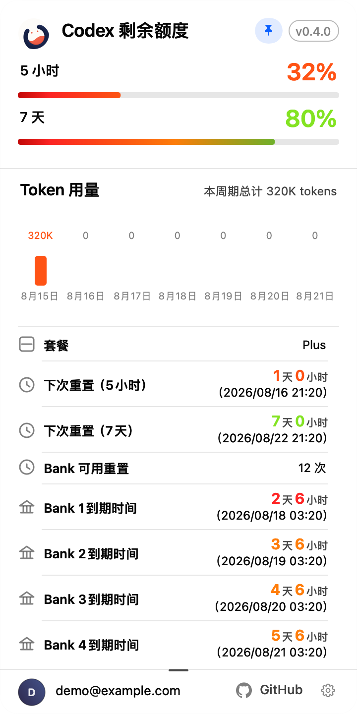
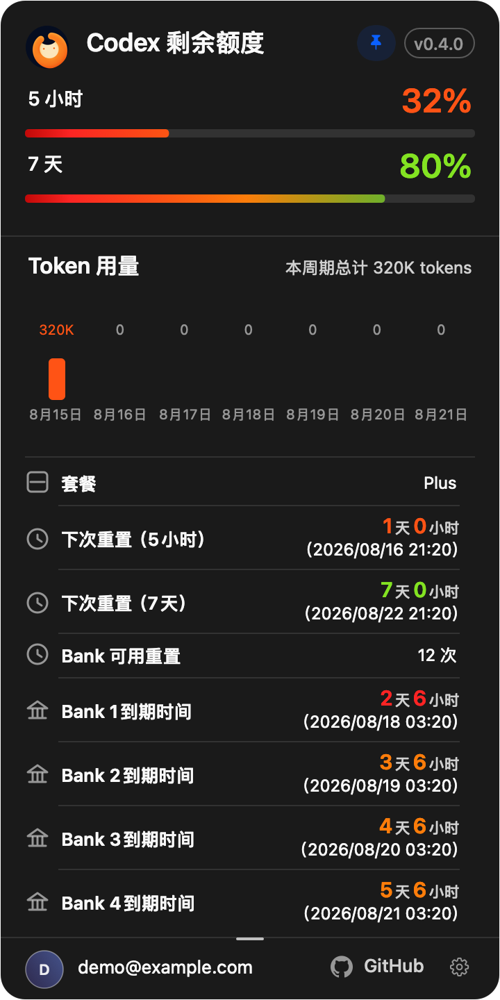
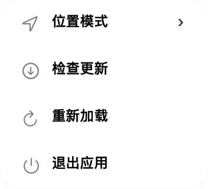

<h1 align="center">Codex Usage Sidebar</h1>

<p align="center">在 Codex 标题栏实时显示剩余额度、重置时间、Credits 与 Bank 明细。</p>

<p align="center">
  <a href="README.md">English</a> ·
  <a href="docs/INSTALL.md">安装运维</a> ·
  <a href="docs/INSTALL_FOR_AGENTS.md">交给 Agent 安装</a> ·
  <a href="docs/TROUBLESHOOTING.md">故障排查</a>
</p>

> [!NOTE]
> 这是独立社区项目，与 OpenAI 无隶属关系，也不代表 OpenAI 官方背书。

## 平台状态

| 平台 | 状态 | 分发方式 |
| --- | --- | --- |
| macOS 14+ Apple Silicon | [`v0.4.0` 发布版](https://github.com/JaceHwang/codex-usage-sidebar/releases/tag/v0.4.0) | 已发布 arm64 DMG，含位置模式、详情锁定、设置菜单和防碰撞改进 |
| Windows 11 AMD64（`x64`） | [`v0.3.3` 发布版](https://github.com/JaceHwang/codex-usage-sidebar/releases/tag/v0.3.3) | 未签名 `x64` 安装包，带签名兼容更新；Windows ARM64 不在支持范围 |

**macOS 0.4.0 已发布。** 下方功能说明对应本次发布。Windows 保持单独验收的 0.3.3 发布版，新的 Windows 源码不代表已完成实机验收。

> [!NOTE]
> 上述发布后的开发源码已将 macOS 和 Windows 浅色详情面板改为不透明纯白色，
> 并取消原有 720 点的产品高度上限；Windows 源码同时补齐了指示器右键位置模式选择。
> 这些源码变更尚不是新的已发布构建；Windows 仍需独立 CI 与实机验收。

完整范围见[当前功能清单](docs/CURRENT_FEATURES.md)和[当前设计说明](docs/CURRENT_DESIGN.md)。

## macOS 实机截图


2026 年 9 月 16 日在 Apple Silicon Mac 上截取，来自已安装的 0.4.0 本地构建。图中为伴生应用实际窗口和实时额度，不包含宿主对话或账号标识。

## 当前实际效果

<p align="center">
  
  
</p>

使用当前 AppKit 控件与固定示例数据重新渲染，展示双额度、七日 Token、详情锁定、Bank 到期颜色和页脚设置入口。图中详情处于锁定状态；不是实机账户截图或正式发布截图。

<p align="center">
  
  
</p>

[配图来源与复现方法](docs/images/current/README.md)。

## 自适应标题栏定位

- **自动贴合**：按实际文字宽度寻找标题栏空位，避让真实按钮、可点击控件和静态标题。
- **默认回退**：找不到安全空位时回到默认位置；默认位置仍与交互控件重叠时，自动切换并保存为「自由移动」。不会因为拥挤而隐藏，也不会自动切回。
- **自由移动**：按住左键拖动，按显示器保存位置。
- **锁定位置**：保持手动位置，禁止拖动；与详情卡片的锁定按钮是两件事。

右键指示器，或打开详情页脚的设置菜单，都能选择位置模式。临时想恢复自动定位时，手动选择「自动贴合」。


## 功能效果

| 操作或内容 | macOS 0.4.0 行为 |
| --- | --- |
| 额度指示器 | 对齐显示 5 小时／7 天剩余比例与重置时间；缺少第二周期时使用单周期显示。 |
| 悬停与点击 | 悬停打开明细；点击固定，再点解除。普通固定卡片可由外部点击关闭。 |
| 详情锁定 | 卡片标题旁的锁定按钮使明细在鼠标移开或外部点击后仍保持打开，直到解锁。 |
| 明细数据 | 双额度进度、七日每日与总 Token 用量、账号、版本、套餐、Credits，以及各条 Bank 状态和到期时间。 |
| Bank 到期提醒 | 距到期不超过 3 天为红色，超过 3 天至 7 天为橙色，超过 7 天为绿色；未知到期时间无紧迫度强调。 |
| 调整高度 | 自然明细视口至少 8 行（256 点），随内容增长；手动调整最少 2 行；拖动底部调整手柄改变滚动区高度，宽度保持 360 点。 |
| 设置菜单 | 位置模式、检查更新、重新加载、退出。检查更新会打开 GitHub Releases，不会自动下载安装。 |
| 外观与语言 | 跟随 Codex 明暗主题及简体中文、繁体中文、英文；其他语言回退英文。 |
| 动态定位 | 自动模式每 0.1 秒重新扫描；只把按钮角色及直接点击／选择动作当成交互对象，不把普通容器的辅助动作当作按钮。 |

缺少快照、数据过期或 Codex 不在前台等情况下仍可能隐藏；这与标题栏拥挤时的自由移动降级不同。

## 快速安装

请按平台选择安装路径。Windows 仅支持 Windows 11 AMD64/x64，不支持 Windows ARM64。Windows
`v0.3.3` 安装程序为未签名本机打包资产，启动前必须先完成 SHA-256 校验。

### Windows 11 AMD64/x64

要求：Windows 11 AMD64/x64、已安装并登录的 Codex Windows 桌面客户端，以及 PowerShell。没有固定的
Codex 文件最低版本；新版本只要提供已验证的安全标题栏语义结构即可使用。结构未知或不安全时，
插件会保持隐藏，直到完成验证。

#### 人工安装

1. 打开 [v0.3.3 GitHub Release](https://github.com/JaceHwang/codex-usage-sidebar/releases/tag/v0.3.3)，只下载
   `codex-usage-sidebar-v0.3.3-windows-x64-setup.exe` 与 `WINDOWS-V033-SHA256SUMS.txt`。
2. 启动安装程序前，先校验 SHA-256：

   ```powershell
   Get-FileHash .\codex-usage-sidebar-v0.3.3-windows-x64-setup.exe -Algorithm SHA256 | Select-Object -ExpandProperty Hash
   ```

   将结果与 `WINDOWS-V033-SHA256SUMS.txt` 中对应条目比较；大小写不影响判断。
3. 摘要匹配后，为当前用户启动安装：

   ```powershell
   Start-Process .\codex-usage-sidebar-v0.3.3-windows-x64-setup.exe
   ```

4. 该安装程序有意保持未签名（`NotSigned`），Windows 可能显示“未知发布者”。只有在 SHA-256
   匹配后，才选择“更多信息”，再选择“仍要运行”。
5. 绝不要关闭 Defender、SmartScreen、杀毒软件或系统策略。摘要不匹配时请删除文件，并从发行页重新下载。
   伴随程序会安装到 `%LOCALAPPDATA%\CodexUsageSidebar\Current`，并通过当前用户的 Run 项自动启动。

如果 Codex 暴露的是不受支持的 UI Automation 结构，Windows 浮层会保持隐藏，而不是猜测坐标。
`--repair`、`--uninstall`、状态输出和验证边界见[安装运维说明](docs/INSTALL.md)。

#### Agent 自动安装

可以把下面这段任务交给 Windows 电脑上的 Agent：

```text
从 GitHub Release 安装 Codex Usage Sidebar v0.3.3。当前电脑必须是 Windows 11 AMD64/x64。
只下载 codex-usage-sidebar-v0.3.3-windows-x64-setup.exe 和 WINDOWS-V033-SHA256SUMS.txt，先验证
安装程序 SHA-256 与发行页对应条目一致，只有摘要匹配时才运行安装程序，并回报安装路径和运行状态。不要关闭或绕过
Defender、SmartScreen、杀毒软件或系统策略。如果出现安装器、SmartScreen、卸载或 Windows 安全对话框，
先停下来让我即时确认，再点击任何按钮。
```

Agent 可以自动完成下载、摘要比对和启动安装器；但不能绕过 Windows 信任界面，也不能在没有实际完成本机
验证时声称 setup 安装/卸载生命周期已经通过。确定性流程见[Agent 安装流程](docs/INSTALL_FOR_AGENTS.md)。

### macOS 14+ Apple Silicon

要求：macOS 14+、Apple Silicon、Codex 桌面版与支持插件的 `codex` CLI。安装器不绑定某个 Codex
版本，会同时搜索标准安装路径和当前 `PATH`；只要 CLI 提供安装器使用的 `plugin marketplace` 与
`plugin add` 命令即可兼容。

#### 安装 v0.4.0 图形安装器

从 [v0.4.0 GitHub Release](https://github.com/JaceHwang/codex-usage-sidebar/releases/tag/v0.4.0)
下载 `codex-usage-sidebar-v0.4.0-macos-arm64.dmg`、`MACOS-V040-SHA256SUMS.txt` 与
`MACOS-V040-PROVENANCE.json`。打开前先校验 DMG：

```bash
shasum -a 256 codex-usage-sidebar-v0.4.0-macos-arm64.dmg
```

将输出与 `MACOS-V040-SHA256SUMS.txt` 对应条目比较；`MACOS-V040-PROVENANCE.json` 记录精确源码提交与内嵌可执行文件摘要。打开已校验的 DMG，再打开 **Codex Usage Sidebar Installer**。该资产尚未公证；如被 macOS 阻止，
请在 Finder 中右键点击安装器并选择“打开”。随后点击 **安装**，按引导完成 Codex 登录，并在 macOS
提示时为 **Codex Usage Sidebar** 开启“辅助功能”；最后点击 **验证**，确认受管理的伴随程序正在运行。

安装器会把文件放在 Codex 应用包之外，也绝不会复制普通 `~/.codex` 凭据。修复、更新和卸载行为请见
[安装运维说明](docs/INSTALL.md)。

#### 从源码复现 macOS v0.4.0 发布资产

请使用 Xcode 26.5 与 macOS SDK 26.5，或通过 `SDKROOT` 明确选择该 SDK。
维护者可从 provenance 中记录的精确 v0.4.0 源码提交重建资产。脚本会把载荷提交写入安装器，且不会覆盖已有资产：

```bash
bash scripts/build-macos-v040-installer.sh
bash scripts/package-macos-v040-installer.sh
bash scripts/verify-macos-v040-installer-package.sh \
  ".dist/v0.4.0/macos/Codex Usage Sidebar Installer.app" \
  ".dist/v0.4.0/macos/codex-usage-sidebar-v0.4.0-macos-arm64.dmg"
```

### 高级：手动 Marketplace 安装

```bash
codex plugin marketplace add JaceHwang/codex-usage-sidebar
codex plugin add codex-usage-sidebar@codex-usage-sidebar
```

安装后请新建一个 **Codex 任务**。Codex 会在任务开始时加载插件，`SessionStart` hook 随后
自动安装并启动伴随程序；这与[官方 Codex 插件流程](https://developers.openai.com/learn/developers-codex-plugin/)
描述的任务边界一致。

插件使用独立 CodexHome，不会复制普通 `~/.codex` 中的凭据。首次安装需单独授权一次：

```bash
env CODEX_HOME="$HOME/Library/Application Support/CodexUsageSidebar/CodexHome" codex login
```

之后按 macOS 提示，为 **Codex Usage Sidebar** 开启“辅助功能”。完整状态检查、更新、修复与
卸载步骤见[安装运维说明](docs/INSTALL.md)。

## 防碰撞定位原理

扫描整个标题栏可影响定位的范围，以实际指示器宽度（164–280 点）和 8 点间距校验最终位置，包括缓存位置和默认位置。结构容器仅有 `AXShowMenu`／`AXScrollToVisible` 动作时不会被误算为按钮；真实按钮及有 `AXPress`／`AXPick` 的控件仍会参与避让。不会读取聊天正文。

语义锚点只是优先定位依据，最终位置可能因搜索空位或手动模式而不同。详见[当前设计](docs/CURRENT_DESIGN.md)。

## 实时额度明细

- 紧凑按钮始终展示剩余百分比和下次重置时间。
- `Codex 剩余额度` 后方的小型蓝色描边徽标直接读取 App Bundle 版本，方便不打开终端就
  判断当前实际运行代码。
- 悬浮卡片展示套餐、额度周期、Credits、Bank 可用次数、每一条 Bank 额度、状态和过期时间。
- 按钮百分比和悬浮百分比共用连续状态色：`100%` 绿色、`49%` 橙色、`10%` 红色。
- 已填充进度条从固定的红→橙→绿光谱中按实时额度裁切，未填充部分保持主题自适应灰色。
- 本地通知到达后立即更新，并带有有界刷新、重置检查与数据流恢复机制。

## 语言自动匹配

当前版本直接跟随 Codex **最终实际显示的语言**。Codex 明确选择的语言优先；设为“自动”时，
插件跟随运行中的 Codex 渲染进程语言。Codex 偏好设置与 macOS 首选语言仅作为启动阶段的安全回退。

| Codex 最终语言 | 插件显示 |
| --- | --- |
| 简体中文（`zh-Hans`、`zh-CN`、`zh-SG`） | 简体中文 |
| 繁体中文（`zh-Hant`、`zh-TW`、`zh-HK`、`zh-MO`） | 繁體中文 |
| 英文（`en-*`） | English |
| 其他语言 | English |

插件不再提供一套独立语言设置，避免与 Codex 不一致。伴随程序每秒检查一次有效语言；已显示或
点击固定的浮窗也会原地更新，无需重新安装插件。

## 为什么 Codex 升级后仍能用

- 伴随程序位于 `~/Library/Application Support/CodexUsageSidebar/`，不在官方应用包中。
- 用户级 LaunchAgent 负责常驻与自动重启。
- 每次运行都会重新发现当前 `com.openai.codex` 和对应的 `codex app-server`。
- 插件更新先校验载荷指纹再原子替换，Codex 官方升级不会覆盖它。
- 安装器会优先使用稳定的本地签名身份重新签署复制后的载荷，使插件重装前后的“辅助功能”
  代码身份保持稳定。
- 修复仍然只需一个命令：

```bash
"$HOME/Library/Application Support/CodexUsageSidebar/sidebar-control.sh" repair
```

“辅助功能”的最终授权始终由 macOS 决定；系统安全策略或签名发生变化时仍可能要求再次确认。

## 隐私与安全

- 只通过 stdio 从本机 Codex `app-server` 读取额度快照。
- 使用隔离的 `CodexHome`，凭据仅由官方 `codex login` 流程创建。
- 不抓网页、不注入 Codex、不读取聊天正文、不上传遥测。
- 只在内存中读取 Codex 渲染进程的语言参数用于匹配；原始进程参数不会写入诊断或日志。
- 只读取合格标题栏控件和静态标题的标签与几何信息；相关区域内的结构组只读取几何信息，
  用于识别面板边界。
- 运行文件只保存在用户的 Application Support 目录。

详见[隐私说明](docs/PRIVACY.md)、[架构说明](docs/ARCHITECTURE.md)和[安全策略](SECURITY.md)。

## 状态诊断

```bash
"$HOME/Library/Application Support/CodexUsageSidebar/sidebar-control.sh" status
```

精确定位正常时会返回常驻 LaunchAgent 进程的真实状态：

```text
pid=12345 version=0.4.0 runtime=shown placement=content-header mode=automatic anchor=labeledControl
language=simplifiedChinese language_source=process
indicator=654,1003,164,46 ... cached:false,source:labeledControl,edge:826
installed and loaded: .../Codex Usage Sidebar.app
```

`mode=automatic/free/locked` 表示当前模式；`freeFallback` 表示当前扫描是否建议因默认位置碰撞而降级。`anchor` 与 `edge` 是语义定位依据，不能再用 `indicator.maxX = edge - 8` 判断所有模式是否正常。版本号应与详情卡片徽标一致。

## 构建来源证明

发布资产绑定精确发布提交、校验和及来源记录。[PROVENANCE.json](plugins/codex-usage-sidebar/assets/PROVENANCE.json) 记录伴生程序源码与可执行文件摘要；发布 DMG 另附 `MACOS-V040-PROVENANCE.json`。本地未提交构建不能充当正式发布证据。安装时可能重新签名，因此安装后字节哈希与源包不同并不直接表示代码不同。

## 开发验证

```bash
./governance doctor
cd plugins/codex-usage-sidebar
bash scripts/build-companion.sh
bash tests/test-sidebar-control.sh
bash tests/test-signing-identity.sh
bash tests/live-app-server-probe.sh   # 需要先登录隔离 CodexHome

cd ../..
./governance check all
```

完整 Swift 测试、arm64 Release 构建、签名选择与严格签名校验均由构建脚本执行。提交 PR 前请
阅读 [CONTRIBUTING.md](CONTRIBUTING.md)。

## 文档索引

- [当前功能清单](docs/CURRENT_FEATURES.md)
- [当前设计说明](docs/CURRENT_DESIGN.md)
- [历史设计索引](docs/superpowers/README.md)

- [安装与运维](docs/INSTALL.md)
- [Agent 安装流程](docs/INSTALL_FOR_AGENTS.md)
- [架构](docs/ARCHITECTURE.md)
- [Windows Beta 开发说明](docs/WINDOWS-BETA.md)
- [Windows 实机诊断交接手册](docs/WINDOWS-DEVICE-HANDOFF.zh-CN.md)
- [故障排查](docs/TROUBLESHOOTING.md)
- [隐私](docs/PRIVACY.md)
- [支持](SUPPORT.md)
- [更新记录](CHANGELOG.md)
- [v0.4.0 发布说明](docs/releases/macos-v0.4.0.md)
- [v0.3.3 发布说明](docs/releases/v0.3.3.md)

## 许可证

[MIT](LICENSE) © 2026 Jace
