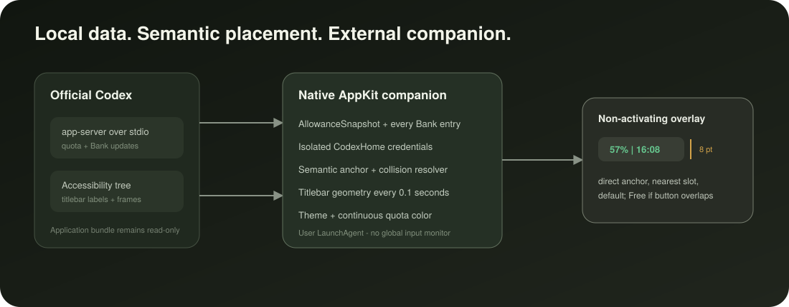

# Architecture

<p align="center">
  
</p>

## Components

1. **Marketplace plugin** provides the installable manifest, skill, and `SessionStart` hook.
2. **Control script** atomically installs, repairs, reports, and removes the user LaunchAgent.
3. **Native AppKit companion** runs outside Codex and renders a non-activating quota panel.
4. **SidebarCore** contains pure rate-limit decoding, formatting, color, layout, transport, and
   anchor-resolution logic covered by Swift tests.

The v0.3.3 line ships a parallel Windows implementation without renaming or replacing the macOS
tree. Sanitized `contracts/` fixtures are decoded by both Swift and .NET tests. The Windows
solution separates a portable core, host boundary, control probe, and installer backend. The
published x64 installer includes the validated selector catalog and a signed HTTPS compatibility
update path; unknown UIA structures remain fail-hidden.

```text
plugins/codex-usage-sidebar/
├── contracts/                  # shared app-server and placement fixtures
├── native/                     # stable macOS Swift/AppKit implementation
└── windows/
    ├── src/
    │   ├── CodexUsageSidebar.Core/
    │   ├── CodexUsageSidebar.Windows/
    │   ├── CodexUsageSidebar.Control/
    │   └── CodexUsageSidebar.Installer/
    └── tests/
```

## Data flow

```text
Codex app-server over stdio
        |
        v
AllowanceSnapshot(primary + optional secondary) + Token usage + account identity + Bank entries
        |
        v
Native AppKit companion
        |
        v
titlebar-band AX scan
        |
        v
preferred semantic anchor + occupied geometry
        |
        v
nearest free slot or safe right-side fallback
```

The companion discovers the running `com.openai.codex` bundle and launches its current
`codex app-server` executable over local stdio with an isolated `CODEX_HOME`. JSON-RPC initialization,
rate-limit reads, notifications, refresh recovery, and reset checks produce an `AllowanceSnapshot`.

Language resolution is independent from quota transport:

```text
running Codex renderer --lang
        |
        v
Codex Preferences fallback
        |
        v
macOS preferred-language fallback
        |
        v
Simplified Chinese / Traditional Chinese / English
        |
        v
localized compact control + detail card
```

The running renderer argument is the final effective locale, so it also reflects Codex's resolved
choice when the application setting is Auto. A script subtag takes precedence over a region;
unsupported locales map to English. Raw process arguments are used in memory only and are never
persisted.

## Placement

The accessibility scan selects the Codex AX window that best matches the active Quartz window. It
scans the full horizontal reach where the 164-point indicator could be placed. Buttons are semantic
anchor candidates; buttons and static title text inside the 46-point titlebar band and with a
meaningfully visible height are both treated as occupied geometry. Structural `AXGroup` frames in
relevant branches are collected only for pane-boundary detection; group labels and text are never
read. Degenerate content elements clipped to a 1-point line at the top of a fullscreen window are
excluded. Open Location is recognized through its title, description, help text, or identifier in
English or Chinese. Geometry eligibility is applied before those control labels are read, and
degenerate branches are pruned before their descendants enter the bounded breadth-first scan.

The resolver first tries the exact frame ending eight points before Open Location. If that frame
intersects native titlebar geometry, it slides left to the nearest complete free slot. A static
title barrier cannot be crossed. When no local slot remains, the resolver deliberately selects the
existing safe right-side fallback instead of allowing an overlap.

Every 0.1-second position tick scans the current eligible titlebar geometry and runs collision
resolution, even when the semantic anchor has not moved. The last resolved anchor value is retained
for at most 0.75 seconds only to bridge a transient incomplete scan. A deliberate fallback with a
resolved edge clears that retained value immediately. Diagnostics expose `openLocation`,
`labeledControl`, `rightPaneBoundary`, or `fallback` as the selected source. The runtime has no
sidebar-state model, global key monitor, global mouse monitor, or code injected into Codex.

The indicator also has an explicit local placement mode. Its default **Automatic** mode resolves
the frame through this same titlebar path. A right-click opens a native segmented selector for
**Free** and **Locked** modes. Both manual modes store a normalized origin per display inside the
display's `visibleFrame`, then clamp the resolved frame on every render; Free accepts only a
deliberate left-button drag and Locked rejects drag input. Manual mode never changes the host
window, and the detail card remains attached to the resulting indicator frame.

## Rendering and freshness

The compact control and hover panel are native AppKit surfaces. They follow the Codex theme and do
not activate or replace native controls. Both percentage labels use one HSB state-color function
with exact anchors at 100% green, 49% orange, and 10% red. The progress fill clips a fixed AppKit
gradient with stops at 0%, 10%, 49%, and 100% across the full track. The hover header also reads
`CFBundleShortVersionString` into a compact outlined badge. The detail model includes independent
5-hour and 7-day windows, seven-day Token usage, account identity, plan, period, Credits, aggregate
Bank availability, and every Bank entry with expiry and status. When `secondary` is absent, the
legacy single-window card and indicator remain unchanged.

Hover shows the detail card transiently. Clicking the quota control pins the same card; clicking
again dismisses it. A one-second language check re-renders visible content from the current
snapshot without changing interaction state or triggering an app-server refresh.

The detail table has a stable default viewport of eight 32-point rows (256 points), so an
initially sparse quota snapshot cannot collapse the card. The user can resize the viewport down to
two rows or up to the screen-safe cap; a requested height overrides the default while the shared
attached-panel layout continues to constrain the card to the visible display.

App-server notifications update the snapshot immediately. Data dims after two minutes and hides
after five minutes; the client restarts stalled or exited streams and schedules bounded refreshes.

## Upgrade boundary

The official Codex bundle remains read-only. The companion, isolated Codex home, data, and
LaunchAgent live under the user's home directory. A Codex upgrade changes discovery input, not the
companion installation. A plugin upgrade fingerprints the source payload, copies it to a temporary
app, applies the stable local signing identity when available, verifies the result, and uses an
atomic rename before restarting the LaunchAgent.

The long-running process atomically publishes a sanitized `runtime-state.txt` containing PID,
bundle version, visibility, mapped language and source, anchor source, indicator frame, and
timestamp. `sidebar-control.sh status`
reports that file only when its PID matches the active LaunchAgent, avoiding misleading
results from a separate one-shot diagnostic process.

## Binary provenance

The marketplace app is promoted from a successful GitHub Actions artifact. `PROVENANCE.json` binds
it to the source commit, workflow run, artifact digest, archive digest, executable SHA-256, and code
directory hash. Validation checks the pinned executable and rejects unpromoted source on `main`.

## Safety properties

- Install and uninstall paths are validated before destructive operations.
- The official Codex application is never modified or re-signed.
- The app-server receives credentials only from the isolated `CodexHome` created by `codex login`.
- The accessibility reader reads labels and frames only for eligible titlebar buttons/static text,
  plus unlabeled structural `AXGroup` frames in relevant branches for pane-boundary detection; it
  does not read conversation bodies.
- Invalid windows, missing snapshots, background host state, and expired data hide the overlay.
